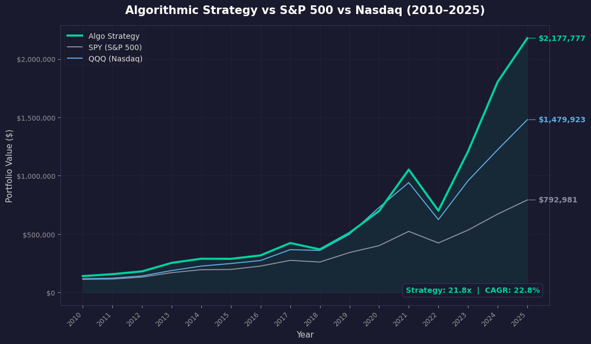

# 📈 Algorithmic S&P 500 Stock Picker

**A quant trading system that beat the S&P 500 by 9 points of CAGR a year, for 16 straight years — built solo, at 18, before basic training.**


<br>



<br>

## TL;DR

$100,000 → **$2,177,777** in 16 years (2010–2025). **+22.8% CAGR**, beating SPY's ~13.8% and QQQ's ~18.3% — backtested with zero look-ahead bias, zero survivorship bias, and an AI layer that never sees a company name. Now running live, fully automated, monitored over Telegram.

---

## Performance Results (Backtest 2010–2025)

| Metric | Strategy | SPY Buy & Hold | QQQ Buy & Hold |
|---|---|---|---|
| **CAGR** | **+22.8%** | ~+13.8% | ~+18.3% |
| **Total Return** | **+2,078%** | +693% | +1,380% |
| **Final Value** ($100K start) | **$2,177,777** | $792,981 | $1,479,923 |
| AI cost (entire 16-year backtest) | **$0.033** | — | — |

> Point-in-time SEC EDGAR data only. No look-ahead bias. No survivorship bias. No cherry-picked dates.

---

## Why This Isn't Just Another Backtest

Most backtests — including ones built by people with finance degrees — cheat without realizing it. They use today's known winners and today's fundamentals to simulate trades made a decade ago. That's not a backtest, it's hindsight wearing a lab coat.

This system was built specifically to eliminate that:

- **45-day SEC filing lag enforced on every single data point** — the engine never sees a number before it would have actually been public
- **Historical S&P 500 constituents reconstructed year-by-year from Wikipedia** — not today's index, so it can't "discover" companies that didn't exist in the index yet
- **25% position cap** — without it, NVIDIA alone grew to 46% of the simulated portfolio by 2024. That's concentration risk, not skill, and the system is built to refuse that shortcut
- **Stock-split EPS correction** — caught and fixed a real bug where a 10-for-1 split desynced EPS and price data, then audited all 7,206 ticker-years in the dataset for the same issue

---

## System Architecture

```
vix_ai_picker.py  (Core Engine)
├── sp500_backtest.py    → 16-year historical simulation
├── paper_trading.py     → Live Alpaca paper trading (same logic, zero reimplementation)
└── daily_scan.py        → GitHub Actions automation + Telegram alerts
```

---

## How It Works

### 1. Score Every Stock (0–110 pts, 5 dimensions)

| Dimension | What It Measures |
|---|---|
| **Quality** | ROE consistency, net margin |
| **Fortress** | Debt-to-equity, free cash flow positivity |
| **Growth** | 3-year revenue CAGR, EPS CAGR |
| **Valuation** | P/E, PEG, FCF yield |
| **Momentum** | 6mo / 12mo performance vs SPY |

Only stocks scoring **65+/110** make the cut — that's roughly 85–90% of the universe eliminated at every rebalance.

### 2. Sell Only When the Business Breaks — Not When the Price Does

A review triggers on any of: ROE collapse, leverage doubling, two-year revenue decline, two-year negative EPS, or extreme valuation (P/E > 60 *and* PEG > 5). A **free-cash-flow override** vetoes ROE-collapse sells for companies that are reinvesting hard but still cash-generative — the system won't reflexively dump the next Amazon for "bad" accounting earnings.

### 3. AI Confirms the Sell — Completely Blind

When a sell rule fires, Claude reviews the decision — **without ever being told the ticker or company name.** It sees only anonymized financial trends, a sector label, and macro context. A leakage validator scrubs any company name that slips through. This forces the model to reason from numbers, not from what it already knows about Apple or Amazon.

Each position gets a max of 2 AI "HOLD" overrides before a forced sell — across the entire backtest, the AI never once needed to be overruled; it self-resolved every time.

---

## Live & Fully Automated

This isn't a Jupyter notebook that ran once. It's running right now:

- **Paper trading on Alpaca** — identical logic to the backtest, same scoring, same rules, same AI layer
- **GitHub Actions** scans daily for new SEC filings on every held position and re-checks thesis
- **Telegram bot** sends daily portfolio summaries and instant alerts on AI sell decisions

---

## Tech Stack

| Component | Technology |
|---|---|
| Language | Python 3.9+ |
| Fundamentals | SEC EDGAR XBRL API |
| Prices | yfinance |
| Universe | Wikipedia S&P 500 historical constituents |
| AI Layer | Anthropic Claude |
| Broker | Alpaca Markets |
| Automation | GitHub Actions |
| Alerts | Telegram Bot API |

---

## Project Structure

```
algo_trade/
├── vix_ai_picker.py      # Core engine: SEC EDGAR, scoring, AI sells
├── sp500_backtest.py     # 16-year historical backtest
├── paper_trading.py      # Live Alpaca paper trading
├── daily_scan.py         # Automated daily monitoring
├── check_portfolio.py    # Portfolio scoring utility
└── .github/workflows/daily_scan.yml
```

---

## Quick Start

```bash
git clone https://github.com/ItayShapiro801/algo_trade
cd algo_trade
pip install -r requirements.txt
```

Add a `.env`:
```
ALPACA_API_KEY=your_key
ALPACA_SECRET_KEY=your_secret
ANTHROPIC_API_KEY=your_key
TELEGRAM_BOT_TOKEN=your_token
TELEGRAM_CHAT_ID=your_chat_id
```

```bash
python sp500_backtest.py     # run the 16-year backtest
python paper_trading.py      # live paper trading (market hours)
python daily_scan.py         # daily monitoring
```

---

## The Three Decisions That Actually Mattered

**Point-in-time data.** Look-ahead bias is the single most common flaw in amateur quant work. Every number here is gated behind a 45-day filing lag — the system literally cannot cheat with hindsight, even by accident.

**A blind AI.** Telling a model "evaluate Apple" lets it lean on everything it already knows about Apple — earnings calls, sentiment, brand. Stripping the identity out forces it to actually reason from the financial trends, which is the only thing worth testing in the first place.

**The 25% cap.** One ticker hit 46% of the simulated portfolio without it. That's not alpha, that's a single bet wearing a strategy's clothes. Capping it is what makes the result a system instead of a story about one stock.

---

## Disclaimer

Educational and research project. Not financial advice. All trading is paper trading — no real capital deployed. Past backtest performance doesn't guarantee future results.
